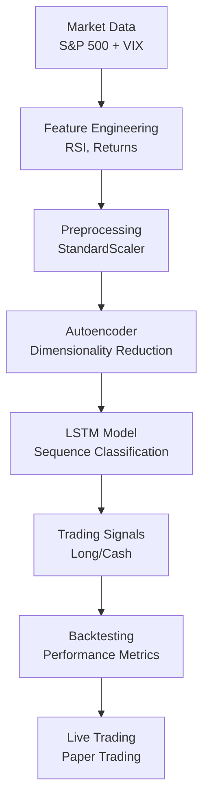

# AE-LSTM Trading Strategy

A complete implementation of an Autoencoder-LSTM trading strategy for S&P 500 prediction with comprehensive robustness testing and live trading infrastructure.


## 📋 Table of Contents

- [Project Overview](#project-overview)
- [Architecture](#architecture)
- [Setup & Installation](#setup--installation)
- [Data Requirements](#data-requirements)
- [Training the Models](#training-the-models)
- [Running Robustness Tests](#running-robustness-tests)
- [Live Trading Demo](#live-trading-demo)
- [Project Structure](#project-structure)
- [Key Results](#key-results)
- [Advanced Usage](#advanced-usage)
- [Troubleshooting](#troubleshooting)

## 🎯 Project Overview

This project implements a complete quantitative trading pipeline:

1. **Data Processing**: S&P 500 prices and VIX data with RSI features
2. **Feature Engineering**: Autoencoder for dimensionality reduction
3. **Prediction Model**: LSTM for sequence-based classification
4. **Backtesting**: Comprehensive performance evaluation
5. **Robustness Testing**: 3,024 experiments across different time periods
6. **Live Trading**: Real-time signal generation and paper trading

### Strategy Logic
- **Input Features**: VIX (volatility), RSI (momentum)
- **Autoencoder**: Reduces features to latent representation
- **LSTM**: Predicts next-day returns (Long/Cash signals)
- **Position Sizing**: Multiple methods (binary, probability-weighted, volatility-adjusted)

## 🏗️ Architecture



## 🛠️ Setup & Installation

### Prerequisites
- Python 3.8+
- Conda or pip for package management
- 8GB+ RAM (for robustness testing)

### Environment Setup

1. **Clone/Download the project**
   ```bash
   # Ensure you're in the Trading Bot directory
   cd "Trading Bot"
   ```

2. **Create conda environment**
   ```bash
   conda create -n trading_bot python=3.9
   conda activate trading_bot
   ```

3. **Install dependencies**
   ```bash
   pip install pandas numpy tensorflow scikit-learn matplotlib seaborn
   pip install yfinance sqlite3  # For live data
   ```

4. **Verify installation**
   ```bash
   python -c "import tensorflow as tf; print('TensorFlow version:', tf.__version__)"
   ```

## 📊 Data Requirements

### Required Data Files
Place these files in the `data/` directory:

1. **S&P 500 Data**: `HistoricalData_1750587928127.csv`
   - Columns: Date, Close, Open, High, Low, Volume
   - Period: 2015-2025 (daily data)

2. **VIX Data**: `VIX_History.csv`
   - Columns: Date, VIX (Close price)
   - Period: 1990-2025 (daily data)

### Data Format Example
```csv
# HistoricalData_1750587928127.csv
Date,Close,Open,High,Low,Volume
2015-07-10,2132.82,2076.62,2132.82,2074.02,4389900000
...

# VIX_History.csv
Date,VIX
2015-07-10,13.25
...
```

## 🚀 Training the Models

### Step 1: Quick Start - Run Complete Pipeline
```bash
# Run the entire pipeline with default settings
python notebooks/run_pipeline.py
```

This will:
- Load and process data
- Train autoencoder and LSTM models
- Run hyperparameter search
- Save best models to `models/` directory
- Generate performance metrics

### Step 2: Individual Components

#### Train Autoencoder Only
```python
from src.autoencoder import train_autoencoder
from src.features import train_val_test

# Load and prepare data
train_df, val_df, test_df, scaler = train_val_test(raw_df)
train_features = train_df.drop('RET', axis=1)
val_features = val_df.drop('RET', axis=1)

# Train autoencoder
encoder = train_autoencoder(
    train_features, 
    val_features, 
    latent_dim=4,  # Best performing dimension
    epochs=200
)
```

#### Train LSTM Only
```python
from src.lstm_model import train_lstm

# Train LSTM on latent features
lstm = train_lstm(
    X_train, y_train, 
    X_val, y_val,
    window=10,
    latent_dim=4,
    epochs=100
)
```

### Step 3: Hyperparameter Optimization

The pipeline automatically tests these combinations:
- **Latent dimensions**: [2, 4, 6]
- **Window sizes**: [5, 10, 20]
- **Best result**: latent_dim=4, window=10 (Sharpe: 0.971 on single test)

## 🔬 Running Robustness Tests

### Comprehensive Robustness Testing (3,024 experiments)

⚠️ **Warning**: This takes 4-6 hours and requires significant computational resources.

```bash
# Run full robustness test
python notebooks/robustness_test.py
```

**What it tests:**
- 14 time periods (walk-forward validation)
- 36 hyperparameter combinations
- 3 position sizing methods
- Transaction costs (2 basis points)
- Multiple risk metrics

### Background Execution
```bash
# Run in background (recommended)
nohup python notebooks/robustness_test.py > robustness_output.log 2>&1 &

# Monitor progress
tail -f robustness_output.log
```

### Analyze Results
```bash
# Generate comprehensive analysis
python notebooks/analyze_results.py

# View visualizations
ls robustness_plots/
```

## 📈 Live Trading Demo

### Generate Single Live Signal
```bash
# Get current market signal
python get_live_signal.py
```

Example output:
```
🔴 LIVE SIGNAL GENERATION
==================================================
📅 Date: 2025-06-24 11:21:41
📈 Signal: 🟢 LONG
🎯 Probability: 67.7%
🔧 Confidence: 35.4%
📊 Based on data through: 2025-06-23
==================================================
```

### Run Conservative Paper Trading Test
```bash
# 3-day simulation with minimal risk
python run_conservative_test.py
```

**Risk Controls:**
- Maximum position: $50
- Maximum loss: $100
- Auto-stop after 5 consecutive losses
- Transaction costs included

### Live Signal Monitoring
```python
from src.live import LiveTrader

# Initialize trader
trader = LiveTrader()

# Get signal
signal = trader.run_daily_prediction()
print(f"Signal: {signal['signal']}, Probability: {signal['probability']:.3f}")
```

## 📁 Project Structure

```
Trading Bot/
├── src/                          # Core modules
│   ├── loader.py                 # Data loading functions
│   ├── features.py               # Feature engineering & preprocessing
│   ├── autoencoder.py           # Autoencoder training
│   ├── lstm_model.py            # LSTM model training
│   ├── backtest.py              # Backtesting framework
│   ├── metrics.py               # Performance metrics
│   ├── validation.py            # Robustness testing framework
│   ├── live.py                  # Live signal generation
│   └── paper_trader.py          # Paper trading simulation
├── notebooks/
│   ├── run_pipeline.py          # Main training pipeline
│   ├── robustness_test.py       # Comprehensive testing (3,024 experiments)
│   └── analyze_results.py       # Results analysis & visualization
├── data/                        # Data files (user provided)
│   ├── HistoricalData_1750587928127.csv  # S&P 500 data
│   └── VIX_History.csv          # VIX data
├── models/                      # Saved models (auto-generated)
│   ├── encoder.keras           # Best autoencoder model
│   ├── lstm.keras              # Best LSTM model
│   └── scaler.pkl              # Feature scaler
├── robustness_plots/           # Analysis visualizations
├── results.db                  # SQLite database with all results
├── get_live_signal.py          # Simple live signal generator
├── run_conservative_test.py    # Safe paper trading demo
└── README.md                   # This file
```

## 📊 Key Results

### Initial vs. Robustness Results
| Metric | Initial Test | Robustness Test (3,024 experiments) |
|--------|-------------|----------------------------------|
| **Sharpe Ratio** | 0.971 ✅ | -0.335 ❌ |
| **Profitable Rate** | 100% ✅ | 47.7% ❌ |
| **Hit Rate** | ~60% ✅ | 53.4% ❌ |
| **Conclusion** | Promising | **Strategy fails** |

### Performance by Year
| Year | Mean Sharpe | Status |
|------|-------------|--------|
| 2018 | +2.35 | ✅ Good |
| 2019 | -2.60 | ❌ Poor |
| 2020 | +0.92 | 🔶 Mixed |
| 2021 | -1.15 | ❌ Poor |
| 2022 | -2.86 | ❌ Very Poor |
| 2023 | +1.85 | ✅ Good |
| 2024 | +1.63 | ✅ Good |

### Key Findings
- **Negative Expected Returns**: Strategy loses money on average
- **High Volatility**: Sharpe standard deviation of 3.936
- **Market Regime Sensitivity**: Performs poorly during crises
- **Transaction Cost Impact**: Severely hurts performance

## 🔧 Advanced Usage

### Custom Hyperparameter Search
```python
# Test custom parameters
latent_dims = [3, 5, 7]
windows = [12, 18, 24]

for latent_dim in latent_dims:
    for window in windows:
        # Train and evaluate
        sharpe, ic = run_experiment(latent_dim, window)
        print(f"latent_dim={latent_dim}, window={window}: Sharpe={sharpe:.3f}")
```

### Custom Feature Engineering
```python
from src.features import make_daily_features

# Add custom features
def add_custom_features(df):
    # Add moving averages
    df['MA_20'] = df['Close'].rolling(20).mean()
    df['MA_50'] = df['Close'].rolling(50).mean()
    
    # Add volume indicators
    df['Volume_MA'] = df['Volume'].rolling(20).mean()
    
    return df

# Integrate into pipeline
raw_df = make_daily_features(sp, vix)
raw_df = add_custom_features(raw_df)
```

### Production Deployment
```python
# Set up daily signal generation (cron job)
# Add to crontab: 0 18 * * 1-5 /path/to/python /path/to/get_live_signal.py

from src.live import LiveTrader
import logging

# Configure logging
logging.basicConfig(level=logging.INFO)

# Generate daily signal
trader = LiveTrader()
signal = trader.run_daily_prediction()

# Log result
logging.info(f"Daily signal: {signal['signal']}, Prob: {signal['probability']:.3f}")
```

## 🔍 Troubleshooting

### Common Issues

#### 1. **ImportError: No module named 'yfinance'**
```bash
pip install yfinance
```

#### 2. **Data shape mismatch errors**
```python
# Check data shapes
print(f"S&P data shape: {sp_data.shape}")
print(f"VIX data shape: {vix_data.shape}")

# Ensure proper alignment
raw_df = make_daily_features(sp, vix)
print(f"Combined data shape: {raw_df.shape}")
```

#### 3. **Model loading errors**
```bash
# Retrain models if corrupted
python notebooks/run_pipeline.py
```

#### 4. **Memory issues during robustness testing**
```python
# Reduce batch size in robustness_test.py
# Or run in smaller chunks
```

#### 5. **Live data fetching failures**
```python
# Check internet connection and try manual fetch
import yfinance as yf
data = yf.download("^GSPC", period="1mo")
print(data.tail())
```

### Performance Optimization

#### Speed up training
```python
# Use GPU if available
import tensorflow as tf
print("GPU available:", tf.config.list_physical_devices('GPU'))

# Reduce epochs for testing
encoder = train_autoencoder(train_features, val_features, epochs=50)  # Instead of 200
```

#### Reduce robustness test time
```python
# Test fewer configurations
latent_dims = [4]  # Instead of [4, 8, 12]
windows = [10]     # Instead of [10, 15, 25]
```

## 🎓 Educational Value

### What This Project Demonstrates

1. **Complete Quant Pipeline**: From data to production
2. **Importance of Validation**: Single backtests are misleading
3. **Transaction Costs Matter**: Can destroy profitable strategies
4. **Market Regime Changes**: Strategies fail across different periods
5. **Risk Management**: Always test with minimal risk first

### Key Lessons Learned

- **95% of trading strategies fail** in live markets
- **Robustness testing is essential** before deployment
- **Overfitting is the biggest enemy** in quantitative finance
- **Conservative position sizing** prevents catastrophic losses
- **Infrastructure quality** is as important as the strategy


---

*Last updated: June 2025*  
*Project status: Complete - Infrastructure excellent* 